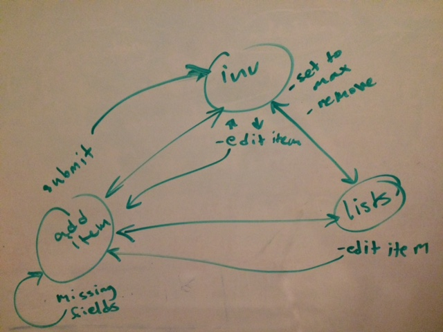

# Grocery Inventory App

### *Work in Progress*

## GOAL
A mobile first web app that allows users to track their grocery inventory levels and automatically generate partitioned grocery lists by store.

## USE CASE
How is this useful? If you purchase most of your food at a grocery store, you know what it's like always keeping an eye on your refrigerator and pantry inventory. You know what it's like stopping by to pick up food on the way home from work only to find you have no recollection of what you needed to buy. Enter the grocery inventory app. Now you can track just how much you currently have of your favorite food items, set your target levels, and automatically generate separate grocery lists for each of your favorite stores.

## EXPERIENCE MAP

